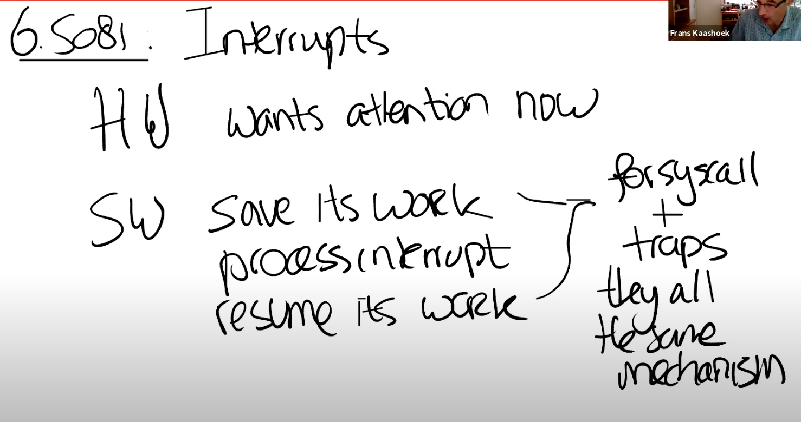

1. 并行来获得高性能
2. 为了确保正确性。当一份共享数据同时被读写时，如果没有锁的话，可能会出现race condition，进而导致程序出错。
3. 
4. 什么时候才必须要加锁呢？如果两个进程访问了一个共享的数据结构，并且其中一个进程会更新共享的数据结构，那么就需要对于这个共享的数据结构加锁。
5. 但如果有两个进程共享一个数据结构，并且其中一个进程会更新这个数据结构，在某些场合不加锁也可以正常工作。不加锁的程序通常称为lock-free program，不加锁的目的是为了获得更好的性能和并发度，不过lock-free program比带锁的程序更加复杂一些。

#### 锁的特性和死锁
1. 通常锁有三种作用，理解它们可以帮助你更好的理解锁。
	1. 	2. 锁可以打包多个操作，使它们具有原子性。
	2. 锁可以避免丢失更新。
	3. 锁可以维护共享数据结构的不变性。
2. 一个死锁的最简单的场景就是：首先acquire一个锁，然后进入到critical section；在critical section中，再acquire同一个锁；第二个acquire必须要等到第一个acquire状态被release了才能继续执行，但是不继续执行的话又走不到第一个release，所以程序就一直卡在这了。这就是一个死锁。
3. 当有多个锁的时候，场景会更加有趣。假设现在我们有两个CPU，一个是CPU1，另一个是CPU2。CPU1执行rename将文件d1/x移到d2/y，CPU2执行rename将文件d2/a移到d1/b。这里CPU1将文件从d1移到d2，CPU2正好相反将文件从d2移到d1。我们假设我们按照参数的顺序来acquire锁，那么CPU1会先获取d1的锁，如果程序是真正的并行运行，CPU2同时也会获取d2的锁。之后CPU1需要获取d2的锁，这里不能成功，因为CPU2现在持有锁，所以CPU1会停在这个位置等待d2的锁释放。而另一个CPU2，接下来会获取d1的锁，它也不能成功，因为CPU1现在持有锁。这也是死锁的一个例子，有时候这种场景也被称为**deadly embrace**。
	1. 这里的解决方案是，如果你有多个锁，你需要对锁进行排序，所有的操作都必须以相同的顺序获取锁。所以需要对相关的锁进行全局排序。但这可能会**破坏了程序的模块化**。

开发的流程是：
	1. 先以coarse-grained lock（注，也就是大锁）开始。
	2. 再对程序进行测试，来看一下程序是否能使用多核。
	3. 如果可以的话，那么工作就结束了，你对于锁的设计足够好了；如果不可以的话，那意味着锁存在竞争，多个进程会尝试获取同一个锁，因此它们将会序列化的执行，性能也上不去，之后你就需要重构程序。

#### 锁与性能

#### 自旋锁的实现
3. 特殊的硬件指令会保证一次test-and-set操作的原子性
4. 在RISC-V上，这个特殊的指令就是amoswap（atomic memory swap）
5. 
	1. 具体的实现依赖于内存系统是如何工作的
		1. 多个处理器共用一个内存控制器，内存控制器可以支持这里的操作，比如给一个特定的地址加锁，然后让一个处理器执行2-3个指令，然后再解锁。因为所有的处理器都需要通过这里的内存控制器完成读写，所以内存控制器可以对操作进行排序和加锁。
		2. 如果内存位于一个共享的总线上，那么需要总线控制器（bus arbiter）来支持。总线控制器需要以原子的方式执行多个内存操作。
		3. 如果处理器有缓存，那么缓存一致性协议会确保对于持有了我们想要更新的数据的cache line只有一个写入者，相应的处理器会对cache line加锁，完成两个操作。

2. spinlock需要处理两类并发，一类是不同CPU之间的并发， 需要**锁**。
3. 一类是相同CPU上中断和普通程序之间的并发。针对后一种情况，我们需要在acquire中**关闭中断**。
4. 实际中，编译器可能会对指令重排，优化掉一些代码路径并进而改变指令的顺序。我们需要使用memory fence或者叫做synchronize指令，来确定指令的移动范围。对于synchronize指令，任何在它之前的load/store指令，都不能移动到它之后。锁的acquire和release函数都包含了synchronize指令。