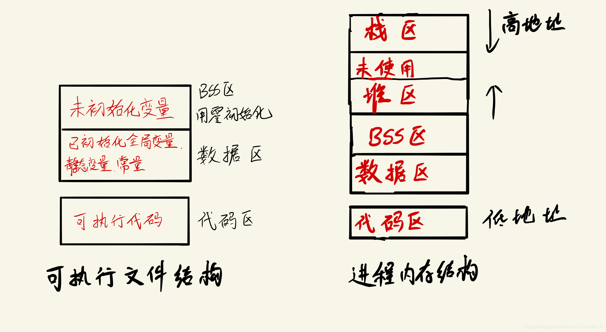
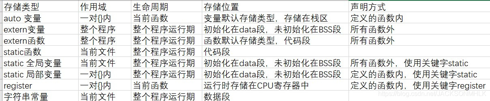

## **1. 介绍**

1. 输出与输入：`cout << "...." << endl;`</br>
    `cin >> variable`</br>
    `endl`表示换行符，会立即flush，刷新缓冲区；</br>
    `'\n'`和`"\n"`也表示换行符，但不会flush，前者表示一个字符，后者表示一个字符串；

2. `using namespace xx`: 声明xx的命名空间</br>
    `std`为系统的标准命名空间</br>
    `::`为作用域符号，如`xx::member`表示xx中的成员member; 也可以用于在class外面定义method</br>

3. `.cpp`存放class的定义；`.h`存放class的声明

## **2. 数据类型**

1. 基本数据类型: bool, char, int, float, double, void, wchar_t

2. 基本类型修饰符: signed, unsign, short, long

3. 枚举类型: 
    `enum color {red, green, blue} c;` 默认情况下， `red == 0`, `green ==1`...

## **3. 变量类型**

1. 变量(和函数)定义, 声明, 初始化: </br>
    变量只能定义一次, 但可以多次声明.
    `int a = 10`: 定义变量a为int类型, 声明变量a, 并进行初始化.(变量和函数定义时会附带声明, 但声明不会附带定义)

2. lvalue: 指向内存位置的表达式被称为左值（lvalue）表达式 </br>
    rvalue: 存储在内存中某些地址的数值, 是不能对其赋值的表达式

3. `0, '\0', '0'`区别: </br>
    0: 32bit 0 </br>
    '\0': 8 bit 0 </br>
    '0': ASCII为48, 00110000.

## **4. 数据作用范围**: 全局变量, 局部变量, 静态全局变量, 静态局部变量, 静态函数

1. 全局变量: 存储在静态存储区中, 作用范围为所有源文件, 生命周期为整个程序运行期间; 其他没有定义它的源文件, 需要用`extern`声明
2. 局部变量: 存储在stack中, 作用范围定义它的函数体内, 只在函数执行期间存在的
3. 静态全局变量: 存储在静态存储区中, 作用范围为该.cpp文件中, 生命周期为整个程序运行期间
4. 静态局部变量: 存储在静态存储区中, 作用范围为定义它的函数体内, 声明周期为整个程序运行期间.
5. static function(): 只能在声明它的文件中使用, 不能被其他文件使用

## **5. 常量**: 在运行期间不会改变, 也称字面量

1. 整数常量, 浮点常量, 布尔常量, 字符常量

2. 字符串常量: 如 string s = "hello world"

3. 定义常量: define 和 const
    1. `#define WIDTH 5` </br>
    2. `char * const p`: p is a **constant pointer** to char </br>
        `char const *p`or `const char *p`: p is a pointer to **constant char**. </br>
        `const char * const p`.
    3. 区别:
        - define是在预处理阶段进行字符串替换, 不分配内存, 不会进行类型检查, 生命周期结束于编译时期; 定义后可以取消定义
        - const在程序编译,运行时使用, 分配内存, 会进行类型检查, 生命周期与变量的作用范围类似; 定义时必须赋值

## **6. 类型限定符**: const, volatile, restrict, explicit

1. volatile variable: variable不放入register, 让程序直接从内存中读取变量. 
2. restrict: restrict 修饰的指针是唯一一种访问它所指向的对象的方式
3. explicit: 由explicit修饰的构造函数, 实例化时必须要进行显式调用, 不是`Dog d = "miaomiao"`(隐式调用), 而是`Dog d("miaomiao)`.

## **7. 存储类**: auto, register, static, extern, mutable, thread_local

1. auto: 根据返回值, 自动推断变量的类型
2. register: 定义存储在寄存器中而不是RAM中的局部变量
3. extern: 在一个文件中声明另一个文件定义的全局变量或函数。
4. thread_local: 声明的变量可以被其他线程访问, 且每一个线程拥有自己的副本. 副本随着线程创建出现, 线程销毁而销毁.
5. static: 
    - 静态成员变量是先于类的对象而存在
    - 这个类的所有对象共用一个静态成员
    - 修饰类public成员时, 可以直接通过class name::member调用(与Java类似). 

## **8. 条件判断**

1. 取最大值: `m = a > b ? a: b`

## **9. 函数**

1. 函数声明: `max(int, int)`, 可以不用指定参数名, 只需要参数类型
2. lambda表达式: 如`auto add = [](int a, int b) -> int { return a + b; };` </br>
   []用于捕获lambda外的变量, 以供lambda表达式使用:
    ```
    []：默认不捕获任何变量；
    [=]：默认以值捕获所有变量；
    [&]：默认以引用捕获所有变量；
    [x]：仅以值捕获x，其它变量不捕获；
    [&x]：仅以引用捕获x，其它变量不捕获；
    [=, &x]：默认以值捕获所有变量，但是x是例外，通过引用捕获；
    [&, x]：默认以引用捕获所有变量，但是x是例外，通过值捕获；
    [this]：通过引用捕获当前对象（其实是复制指针）；
    [*this]：通过传值方式捕获当前对象； 
    ```

## **10. 数组**

1. 初始化char数组时, 需要手动添加`'\0'`, 如` char a = ['k, 'k', '\0']`;
    `char a[] = "kk"`, 自动在末尾添加`'\0'`</br>
    `char a[7] = runoob`, 注意这里是7, 6会报错.
2. setw(int n)可以用来控制输出间隔
3. C/C++对char型数组做了特殊规定，直接输出首地址时，会输出数组内容。如果想得到地址，可采用 & 。

## **11. 引用 vs 指针**

1. C++ FAQ: *Even though a reference is often implemented using an address in the underlying assembly language, please do not think of a reference as a funny looking pointer to an object. A reference is the object. It is not a pointer to the object, nor a copy of the object. It is the object.*
2. 一般情况下, 可以将reference看作时objcet本身即可.
3. 但其实啊, 它有点类似const pointer, 并会automatic indirection(ie the compiler will apply the * operator for you.).
4. reference必须在定义时赋值, 且不能时nullptr.

## **12. 结构体**

1. class中默认成员访问为private, 而struct中默认public
2. class继承默认为private, struct中默认public(继承是怎从么回事???)

3. 结构体大小与内存对齐
4. C的结构体中不能有函数, C++可以</br> </br> </br>

## **1. 类与对象**

1. 在类内部定义的成员函数默认为`inline`的; 在外部定义的成员函数时, 格式为`return_type class_name:: function_name(){}`, 如果要inline, 则在前面加上inline.(inline有什么用?) 
2. `::‵前不加类名时, 表示全局函数或全局变量

3. 类访问修饰符: `public`, `protected`, `private`.
   - private: 在本类和friend类中可访问 
   - protected: 只在子类中可访问 

4. 构造函数, 析构函数, 拷贝函数:
   - 构造函数可以override, 使用初始化列表来初始化字段:`Line::Line(double len): length(len){}`相当于`length = len`
   - 析构函数没有返回值和参数, 内部使用`delete‵来释放资源.
   - 当类成员中含有指针类型成员或需要对其分配内存时，需要定义拷贝函数(最好是private) 
   - inline: 如果一个函数是内联的，那么在编译时，编译器会把该函数的代码副本放置在每个调用该函数的地方.(用空间换时间)</br>
     在类定义中的定义的函数都是内联函数，即使没有使用`inline`说明符。
   - friend函数: 友元函数有权访问类的所有私有（private）成员和保护（protected）成员。友元函数需要在类的定义中声明, 但是它并不属于类的成员函数。
   - this指针: 是指向自身object的**指针**
   - static: 静态成员只有一个副本, 静态成员的初始化不能在类的定义中.

## **2. 继承与多态**

1. 子类不继承父类的: 构造函数, 析构函数, 拷贝构造函数; 重载运算符; 友元函数
2. 多态需要`virtual`来创建虚函数, 进行**动态链接**子类`overwrite`的实现函数.</br>
   动态连接: 每个带有虚函数的类都有一个VTABLE, 子类的VTABLE继承父类的VTABLE, 并且会修改已被`overwrite`的函数的虚拟地址.
3. 纯虚函数: 该类为抽象类, 不可实例化, 同时需要子类实现该接口. 


## **3. 重载**

1. 函数重载(override): 函数同名但参数不同
2. 运算符重载: 如重载`+`运算符: `Box operator+(const Box&){...};`</br> </br> </br>


## **1. 异常处理**

## **2. 动态内存**

1. `new`动态分配内存, 并创建对象; `malloc`只分配内存; 都返回指针
2. `delete`与`free`类似, 释放内存

3. `delete`与`delete []`区别: 
   - 对于简单类型(如int, double, struct), 无论是数组还是非数组形式, `delete` and `delete []`的内存释放效果相同
   - 对于一组数组对象, 则需要调用`delete []`来释放内存

## **3. 模板**

1. 将`template <typename/class T>`放在类或者函数前面, `T`就是数据类型的placeholder.

## **4. 预处理与#,##运算符**

## **5. 信号**

1. `signal(registerd signal, signal handler)`, 使用handler函数处理信号
2. `raise(signal sig)`可以引发信号


## 其他

CS15-445 recommendation about C++: If you have not used C++ before, here is a [short tutorial](http://www.thegeekstuff.com/2016/02/c-plus-plus-11/) on the language. More detailed documentation of language internals is available on [cppreference](https://en.cppreference.com/w/). [A Tour of C++](https://cmu.primo.exlibrisgroup.com/discovery/fulldisplay?docid=alma991019600108604436&context=L&vid=01CMU_INST:01CMU&search_scope=MyInst_and_CI&isFrbr=true&tab=Everything&lang=en) and [Effective Modern C++](https://cmu.primo.exlibrisgroup.com/discovery/fulldisplay?docid=alma991019578256104436&context=L&vid=01CMU_INST:01CMU&search_scope=MyInst_and_CI&tab=Everything&lang=en) are also digitally available from the CMU library.

### C++
#### 关键字
1. const: 
	1. 修饰变量: 该变量不可改变
	2. 修饰指针:
		1. 在`*`的左边, 指向常量的指针（常量指针）
			1. `const int* a = &[1]`(修饰的int); `int const *a = &[2]`(修饰的`*a`)
		2. 在`*`的右边, 修饰指针, 即该指针为常量（指针常量）
			1. `int* const a = &[3]`(修饰的a)
	3. 修饰函数和参数
		1. 参数`const A& a`: 既避免了拷贝, 又避免了函数中对参数的修改
		2. 修饰返回值: 
			1. 以指针传递: `const char* f()`, `const char* str = f()`, 指针指向的内容不能被修改; 
			2. 以引用传递: 返回值的内容不能被改变
		3. 修饰成员函数: 该函数不会修改成员数据
	4. 类中: 
		1. const成员变量, 不能在声明时初始化, 只能在类构造时初始化.
		2. const A a: 常量对象只能调用常量函数
		3. **static变量的赋值, 必须在class外面**
2. typedef 和 define的区别: 
	1. 用法不同：typedef定义数据结构的别名，增强可读性；而define定义常量，以及书写复杂且频繁使用的宏
	2. 执行时间不同：typedef在编译时执行，且有类型检查；而define在预编译时进行简单的字符串替换。
	3. 作用域不同：typedef有作用域限定，而define没有
3. define与const区别: 
	1. const在编译时处理, 有类型安全检查, 要分配内存, 存储在数据段, 不可取消; define在预编译时字符串替换, 无类型安全检查, 不分配内存, 存储在代码段, 可取消.
4. extern: 修饰变量的声明，说明此变量将在文件以外或在文件后面部分定义。
5. this: 
	1. 每次对象调用非静态成员函数时, 编译程序先将对象的地址赋给 `this` 指针, 然后`this`指针作为隐含参数传入成员函数中.
	2. `this` 指针被隐含地声明为: `ClassName *const this`，这意味着不能给 `this` 指针赋值；在 `ClassName` 类的 `const` 成员函数中，`this` 指针的类型为：`const ClassName* const`，这说明不能对 `this` 指针所指向的这种对象是不可修改的（即不能对这种对象的数据成员进行赋值操作）
	3. `this`是右值, 不能取地址
	4. 当成员函数被调用时，会自动向它传递一个隐含的`this`指针.
6. inline: 
	1. 将函数体写在调用`inline`的函数处, 不用执行进入函数的步骤(空间换时间);
	2. 相当于宏, 但多了类型检查; 
	3. 在类中定义的函数, 除了虚函数之外都自动隐式的转为内联函数; 类外定义的函数需要显式转化.
	4. 内联(编译时)可以修饰虚函数, 但虚函数表现为多态(运行时)时则不可内联.
7.volatile:
	1. volatile 关键字是一种类型修饰符，用它声明的类型变量表示可以被某些编译器未知的因素（操作系统、硬件、其它线程等）更改。(主要用于多线程中)
	2. volatile 关键字声明的变量, **每次访问时都必须从内存中取出值**.
	3. const可以是volatile(只读寄存器), 指针可以是volatile.
8. assert: 断言, 是**宏**, 而非函数, assert 宏的原型定义在 `<ass.ert.h>`（C）、`<cassert>`（C++）中.
9. `#pragma pack(n)`:设定struct、union以及类成员变量以 n 字节方式对齐
10. struct 中的: `unsigned int b: 3`
	1. 声明具有以位为单位的明确大小的**类数据成员**, 不能时静态数据成员.
	2. 只能是整型或者枚举类型
11. extern "C": 让 C++ 编译器将 `extern "C"` 声明的代码当作 C 语言代码处理
12. struct 与 class
	1. 默认的访问控制: struct是public, class是private
13. explicit: 
	1. 修饰构造函数时，可以防止隐式转换和复制初始化
	2. explicit 修饰转换函数时，可以防止隐式转换，但 [按语境转换](https://zh.cppreference.com/w/cpp/language/implicit_conversion) 除外
14. decltype: 关键字用于检查实体的声明类型或表达式的类型及值分类.
15. 虚析构函数: 为了解决基类的指针指向派生类对象，并用基类的指针删除派生类对象。
16. 虚指针和虚函数表:
	1. 虚指针：在含有虚函数类的对象中，指向虚函数表，在**运行时**确定。
	2. 虚函数表：在程序只读数据段(`.rodata section`), 存放虚函数指针，如果派生类实现了基类的某个虚函数，则在虚表中覆盖原本基类的那个虚函数指针，在**编译时根据类的声明**创建。
17. 虚继承: 解决多继承条件下的菱形继承问题
#### 类的大小
1. 类的成员函数，静态成员函数和静态数据，都不占大小；仅成员数据占大小。
2. 类中若存在虚函数，只有一个虚指针指向虚表
3. 类中也有字节对齐
4.  空类占1 byte


#### C++内存段
1. 
1. head and stack
	1. 自由存储区: 使用`malloc()`和`free()`进行分配和释放
2. text segmen: 包括程序的机器代码 + 只读数据
3. data: 
	1. data: 存放已初始化的全局变量
4. bbs(Block Started by Symbol): 存放未初始化的全局变量, 在文件中不占用空间, 在加载时用0填充.
5. **几种存储类型**的存放空间
	1. auto: 一般用于局部变量，自动识别类型，存储在stack中
	2. extern: 用来声明其他文件中的全局变量。若已初始化，则data区；否则bbs区
	3. register: 寄存器
	4. static: 无论是全局还是局部变量，都存放在data区
	5. 字符串常量: data区
	6. 
6. **比较变量区别的角度**: 作用域的不同；内存存储方式的不同；生命周期的不同；使用方式的不同.
7. [C/C++内存管理详解](https://chenqx.github.io/2014/09/25/Cpp-Memory-Management/ "C/C++内存管理详解")
8. [C++ 堆区，栈区，数据段，bss段，代码区](https://blog.csdn.net/JACKSONMHLK/article/details/114392343)


#### C++全局变量, 静态变量, 局部变量
\ |全局变量 | 静态全局变量 | 静态局部变量 | 局部变量
-- | -- | -- | -- | -- 
生命周期 | 整个程序 | 整个程序 | 整个程序 | block
作用域 | 所有源文件 | 本源文件 | block内 | block内
定义方法 | 使用extern引用 | 全局static和const | block内static | block内
内存位置 | data | data | data | stack

3. [全局变量、静态变量、局部变量的生存周期与作用域](https://blog.csdn.net/nine_cc/article/details/105472698)


#### 返回局部变量
1. pass by value, 返回局部变量本身
2. 返回一个字符串常量`char *str = "hello"`, 不能返回`char str[] = "hello"`.
3. 非要返回一个局部变量地址, 可以在函数内部, 通过`static`将本地变量转化为静态变量
4. 返回`new`的对象, 但需要外部释放, 不建议


#### c++容器的方法
1. 迭代器失效的情况
2. 成员函数表格


#### C++内存管理

#### C++字符串
###### 拷贝构造和赋值构造
1. 拷贝构造函数`string(const string &s)`, 形参通常是`const T&`, 不能传入实例, 否则会造成无限递归.
2. 赋值操作符重载`string& operator=(const string &s)`, 第一个操作数隐式绑定到`this`指针.
3. 深拷贝和浅拷贝: 当数据成员中有指针时, 必须调用深拷贝, 将指针指向的对象重复赋值一份.
4. 赋值函数: 1. 检查自复制; 2. 释放原有资源; 3. 重新分配资源并拷贝; 4. 返回本对象的引用
5. 拷贝 vs 赋值: **如果临时变量是第一次出现，那么调用的只能是拷贝构造函数，反之如果变量已经存在，那么调用的就是赋值函数**
6. [C++ 拷贝构造函数与赋值函数](https://blog.csdn.net/wenqian1991/article/details/29178649)
###### char* 
1. `char* p = "hello world"`
2. 字符串常量存在静态存储区, `p`指向静态存储区
###### char[]
1. `char p[128]`
2. 数组存储空间为stack, 使用`+`拼接后的字符串的空间地址可能不连续
###### string
1. `string s = "hello world"`
2. `string`的数据内容存储在stack或者heap中, 大于16字节的变量放在heap中，小于等于16字节的变量放在stack中.
###### return a string
1. `string func()`: `return str`, 编译器会自动`move`
2. `string& func(string& des, string& src)`, 原地修改, `return des`
3. `char* func(string& s)`, `return s.data()
4. 
5. 
6. 
7. `


#### C++11特性
###### 左值与右值
1. 左值是可寻址的变量，具有持久性
2. 右值一般是不可寻址的常量，或在表达式求值过程中创建的无名临时对象，具有短暂性
3. 左值引用&：引用一个对象
4. 右值引用&&：短暂引用一个右值, 实现移动语义.
5. [左值与右值](https://nettee.github.io/posts/2018/Understanding-lvalues-and-rvalues-in-C-and-C/)
###### shared_ptr 
1. 定义: 通过指针保存对象的共享所有权的智能指针. 以下情况销毁对象:
	1. 最后占有对象的shared_ptr被销毁
	2. 最后占优对象的shared_ptr通过`=`或`reset()`赋值为另一指针
2. 公开方法:`reset, swap, get, *, ->, [], use_count, unique, owner_before`
3. 相比于`new`的优势
	1. `new`出来的对象必须在局部范围内`delete`(外部无法`delete`, 会造成内存泄露), 无法在外部使用. 而`shared_ptr`可以通过计数, 将局部范围的变量用于外部. 
	2. `shared_ptr`中存在引用计数, 当引用计数为0时, 自动释放内存.
4. 事故:
	1. 循环引用: 使用`weak_ptr`进行解决, `weak_ptr`时`shared_tpr`的观察者, 但却不参与引用计数中.
	2. 多个无关的`shared_ptr`共同管理一个裸指针, 解决办法: 不要将`new`用在shared_ptr构造函数参数列表以外的地方，或者干脆不用`new`，改用`make_shared`。
	3. 
6. [详细连接](https://www.jianshu.com/p/5e2000c3f6a7)
7. [shared_ptr 原理与事故](https://heleifz.github.io/14696398760857.html)


###### weak_ptr
1. 定义:`std::weak_ptr` 是一种智能指针，它对被 `std::shared_ptr`管理的对象存在**非拥有性**（“弱”）引用, 在访问前必须先转化为`std::shared_ptr`。
	1. `std::weak_ptr` 用来表达**临时所有权**的概念：当某个对象只有存在时才需要被访问，而且随时可能被他人删除时，可以使用 `std::weak_ptr` 来跟踪该对象.
	2. 需要获得临时所有权时，则将其转换为`std::shared_ptr`. 此时如果原来的 `std::shared_ptr`被销毁，则该对象的生命期将被延长至这个临时的 `std::shared_ptr`同样被销毁为止。
2. 公开方法: `reset, swap, use_count, expired, lock, owner_before`


###### unique_ptr
1. 定义：拥有并管理另一个对象的智能指针，当unique_ptr超出作用域时，销毁对象。
2. 公开方法：`release, reset, swap, get, get_deleter`
3. `make_unique`: 创建一个管理新对象的独占指针
4. `unique_ptr` 的赋值运算符`=`只接受由`std::move`生成的右值


#### C++50问
1. 变量的定义与声明
2. sizeof与strlen区别，3点：sizeof 在编译时确定，strlen 在运行时确定
3. static在C与C++中的区别：除了都可以定义局部静态变量和全局静态变量之外，C++中可以修饰静态变量和静态成员函数
4. malloc与new的区别，5点：new 可以调用对象的构造函数，对应的delete 调用相应的析构函数。

6. 数组中a与&a区别：a为数组的首地址，&a为指向数组的指针
7. strcpy, memcpy, sprintf区别: 
8. 面向对象三大特性：封装，继承和多态
9. C++空类有哪些函数：默认构造，默认赋值，默认拷贝构造，默认析构，默认取址运算符和默认取值运算符const
10. 拷贝构造函数生成新的实例（**必须以引用的方式传递参数**），而赋值运算符是将对象的值复制给一个**已经存在的实例**
	1. **当有类中有指针类型的成员变量时，一定要重写拷贝构造函数和赋值运算符，不要使用默认的。**
12. 重写和重载的区别：重写是子类重写父类的函数；重载是同一类中，函数名相同，参数不同。
	1. 隐藏：**不同作用域中定义的同名函数构成隐藏**，如局部同名函数隐藏全局同名函数。
13. 简述多态的实现原理：若类中存在虚函数，则有vptr指向vtable，vtable中存储着虚函数的指针。在生成实例时，先调用父类的构造函数，再是子类的构造函数，则开始时，先生成父类的vtable，再替换vtable中被重写的虚函数，形成子类的vtable.
14. 链表和数组的区别
15. 反转链表，递归算法和循环算法
16. 10各排序算法
17. 编程规范：程序的可行性，可读性，可移植性和可复用性
18. C++引用和C指针的区别，3点
19. 写一个标准的宏MIN：#define min(a,b) ((a) < (b) ? (a) : (b))

21. 构造函数不能为虚函数，且不能在构造函数中调用虚函数；但析构函数可以为虚函数
